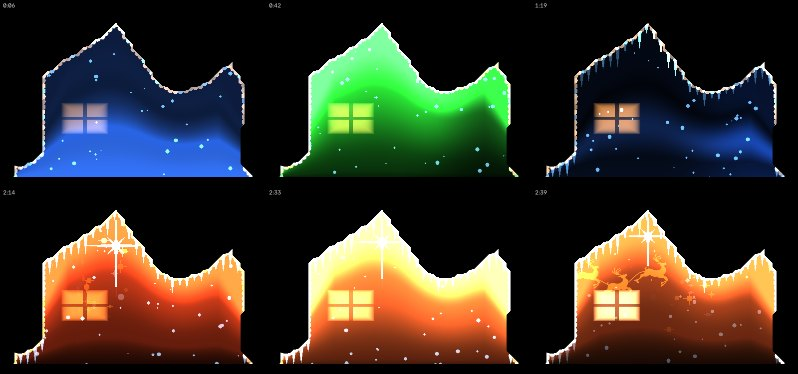
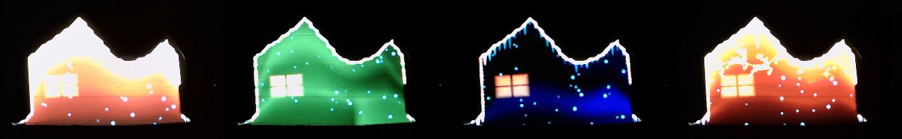

# facade-scan

[](https://github.com/grantjohnson13/Projection_Mapping_Automation/actions/workflows/ci.yml)
[](https://www.python.org/downloads/)
[](LICENSE)

Automated projection mapping for architectural projection — built for putting
Christmas light projection on a house without hand-tracing a single roofline.

You project a sequence of striped patterns at the house, photograph each one,
and the tool works out which projector pixel lit which camera pixel. After that,
anything you find in the photograph transfers into projector space by lookup.



*Six moments from a music-driven show, generated from a scan of the target.*



*The same show on the physical target — a cardboard house silhouette. Light
stops at the cardboard's edge because the mask came from measuring where the
projector's pixels actually landed, not from tracing an outline by hand.*

```bash
facade-scan run     --scan scan --backend webcam    # scan the house
facade-scan animate --scan scan --audio carol.mp3 --play
```

## The problem this actually solves

The tedious part of projection mapping is not finding edges in a photo. It is
establishing the camera-to-projector correspondence, and that **cannot be a
single homography**, because a house is not a plane. The main wall, the garage
bump-out, the gables, the window reveals and the eaves are all at different
depths. A homography fitted to one of them is wrong on all the others.

So facade-scan measures the correspondence instead of modelling it, using
structured light:

1. Project `ceil(log2(W))` vertical and `ceil(log2(H))` horizontal Gray-code
   stripe patterns, each followed by its photographic inverse, plus an all-white
   and an all-black frame. For a 1920x1080 projector that is **46 frames**.
2. Read each bit per pixel as `pattern > inverse`. Because both exposures are
   affected identically by surface albedo, ambient light and lens vignetting,
   those all cancel — dark brick and white trim decode the same way, and no
   global threshold is ever needed.
3. The result is a dense camera-pixel → projector-pixel map with no calibration
   math, no lens model, and no planarity assumption anywhere.

**How much does the planarity assumption actually cost?** It is worth being
precise rather than hand-wavy. The error a homography makes on a surface it was
not fitted to is the stereo disparity of the depth step:

```
error_in_projector_pixels  ≈  fx · B · (1/z_near − 1/z_far)
```

where `B` is the camera–projector baseline and `fx` the projector's focal length
in pixels. For a 1 m garage bump-out at 14 m, a 0.6 m baseline and a 1920-wide
projector, that is about **8 pixels** — small but visible on a garage door edge.
Move the camera to 1.5 m away, or map a 2 m porch, or use a 4K projector, and it
grows linearly in each. facade-scan's error is the same on every surface
regardless: sub-pixel. There is also no manual point-picking, which is the part
that actually takes the evening.

## Why Gray code, and why the inverse frames

**Gray code, not plain binary.** Adjacent Gray code words differ in exactly one
bit, so the bit boundaries are spread across different columns and a misread at
any one of them costs exactly one projector pixel. In plain binary, `0111 →
1000` flips four bits at the same column, and a misread there can move the
decoded coordinate by half the image. Gray code has a second quiet advantage:
its finest plane has *two*-pixel stripes where binary's least significant bit
alternates every pixel, so the hardest plane to resolve is twice as wide — which
matters through a defocused lens at 15 metres.

**Every pattern also gets its inverse.** This doubles the frame count and is not
optional. A camera pixel on dark brick under a lit stripe is easily darker than
one on white trim under an unlit stripe; there is no global threshold that
separates lit from unlit across a real facade. The per-pixel comparison against
the inverse gets both right, and `|pattern − inverse|` falls out as a free
per-pixel confidence measure.

## Install

```bash
python -m venv .venv && source .venv/bin/activate
pip install -e .
```

Python 3.11+. Requires `opencv-contrib-python` (not `opencv-python`) — the line
detector lives in the contrib modules. `torch` and `segment-anything` are
optional extras (`pip install -e '.[sam]'`) and nothing in the pipeline needs
them.

Scanning needs nothing else. `animate` additionally wants the **`ffmpeg` CLI**
on your `PATH` (`brew install ffmpeg`, or your package manager) — it decodes the
audio and muxes it back into the rendered MP4. Audio analysis itself is numpy
only. Without ffmpeg, `animate` says so rather than failing obscurely, and the
rest of the tool is unaffected.

## Try it without a house

The simulator renders a synthetic house — main facade, garage bump-out, two
gables, an eave overhang, recessed windows and doors — through a modelled
projector and camera, and it knows the exact ground-truth correspondence. The
whole pipeline runs on it:

```bash
facade-scan run --scan scan --simulate --no-preview
```

This is also how the project is tested: every numerical stage is scored against
the simulator rather than against mocks.

## Physical setup

This is the part that determines whether your scan works. The software cannot
rescue a bad capture.

**Projector.** Square it up physically and turn digital keystone *off* if you
can — keystone correction resamples the panel and blurs the finest stripes.
Focus on the main wall, not the gable. Set the OS to output the projector's
native resolution with no scaling: if the panel is 1920x1080, send it 1920x1080.

**Camera.** Mount it **as close to the projector lens as physically possible**.
This is the single most important placement decision. The separation between
them is what creates projector shadows — strips of house the camera can see and
the projector cannot reach — and no decoder can recover those, because there is
genuinely no light there. The same separation is what makes the disparity term
above large.

The camera should also out-resolve the projector over the facade. A DSLR does
this by a wide margin; a 720p webcam pointed at a 1080p projector does not, and
the low-order bits will not decode. Roughly: you want at least ~1.5 camera
pixels per projector pixel on the wall.

**Everything manual.** Exposure, white balance, focus, ISO. Every automatic
feature is a feedback loop that reacts to the scene, and the scene here swings
between mostly-white and mostly-black dozens of times. Auto-exposure applied
differently to a pattern and its inverse breaks the one comparison everything
rests on.

**Expose for the white frame.** Bright but not clipped — check the histogram.
Clipped highlights decode as ambiguous bits.

**Then do not touch anything.** Not the focus ring, not the zoom, not the
tripod, not the keystone. Moving either device after the first frame invalidates
the whole scan.

## Night-of walkthrough

Allow about twenty minutes, most of it setup.

**1. Set up, before it is fully dark.** Position the projector, square it up,
focus it on the wall. Mount the camera beside the lens. Get the house framed
with a little margin — you want to see the whole lit area.

**2. Wait for real darkness.** Turn off porch lights and security floods.
Streetlights you cannot switch off are survivable, but they cost contrast.

**3. Check exposure on white.**

```bash
facade-scan patterns --out patterns
```

Project `0000_white.png` and `0001_black.png` by hand and look at the histogram
on both. White should be bright and unclipped; black should be near-black.

**4. Run the scan.** With a webcam or tethered DSLR:

```bash
facade-scan capture --scan scan --backend webcam
facade-scan capture --scan scan --backend gphoto2
```

Or shoot it yourself — this always works, and is the fallback when the others
will not cooperate. Project each pattern in filename order, photograph each one,
drop the files in a directory, then:

```bash
facade-scan capture --scan scan --backend folder --folder ./photos
```

The folder backend matches photographs to patterns by **sorted filename order**,
so the directory must contain the scan and nothing else.

A preflight checklist prints before anything happens. Read it; it is the same
list as above and it is there because each item has ruined a scan.

**5. Decode, detect, export.**

```bash
facade-scan decode --scan scan     # -> decoded.npz, and a coverage number
facade-scan detect --scan scan     # -> detection.json
facade-scan export --scan scan     # -> export/mask.png, regions.svg, scan.json
```

Check the coverage number `decode` prints before going further. Below ~15% and
something is wrong — see troubleshooting.

**6. Check it on the wall, before you pack anything away.**

```bash
facade-scan preview --scan scan --blink-ms 600
```

This projects the computed mask straight back at the house. The mask edge should
sit exactly on the edge of the house. Blinking is worth using: a static edge a
few pixels off the roofline is genuinely hard to judge from the driveway, and a
blinking one is obvious. Press `space` to step through detected regions, `a` for
all of them, `o` to change mode, `q` to quit.

If the mask is off by a consistent few pixels everywhere, the projector moved
and you need to rescan. If it is off only around the garage or under the eaves,
the decode was poor *there* — look at coverage rather than rescanning.

Or do the lot in one command:

```bash
facade-scan run --scan scan --backend folder --folder ./photos
```

## What you get

**`export/mask.png`** — projector resolution, white means project here. This
one file is most of the practical value: it lights the house accurately and
stops light spilling onto the sky, the driveway and the neighbours' hedge.
Windows come out dark for free, because glass barely decodes.

```bash
facade-scan export --scan scan --mask-only
```

**`export/regions.svg`** — one labelled path per region, in projector pixel
coordinates, on a canvas exactly the size of the panel. Regions with openings in
them (a facade with windows) are a single path with `fill-rule="evenodd"`, so
the openings stay unlit. Import it into any mapping tool or vector editor.

**`export/scan.json`** — the same geometry as data, plus decode confidence
statistics.

### On project files for MadMapper, Resolume and friends

facade-scan deliberately does **not** write them. Those schemas are
undocumented and change without notice, and a plausible-looking file built from
a guessed-at schema is worse than no file: it opens, it looks fine, and the
geometry is subtly wrong in a way you discover on the night.

Instead there is a documented `Exporter` ABC with three working implementations,
and `ScanExport` hands an adapter everything it could need, already in projector
pixels. When you know a real schema, an adapter is a serialiser:

```python
from facade_scan.export import Exporter, register_exporter

class MyToolExporter(Exporter):
    name = "mytool"
    extension = ".mytool"

    def export(self, scan, path):
        path.write_text(serialise(scan.regions, scan.projector_width))
        return path

register_exporter(MyToolExporter())
```

## Animating it to music

A mask is not the end of the job — it is the thing you decorate. `animate`
takes a scan and an audio file and drives an animation through the mask, so
light lands on the house and nowhere else.

```bash
facade-scan animate --scan scan --audio carol.mp3 --out show.mp4 --play
```

`--out` writes an MP4 with the audio muxed back in — one file you can open
fullscreen and loop on the night. `--play` puts it on the projector live. Both
together is fine. There is no cue sheet to write: the track is analysed for
tempo, beats, loudness and brightness, and every layer is pulled off those.

| layer | driven by |
|---|---|
| wash colour | a timed cycle through a deep, saturated palette |
| wash level | loudness — quiet passages fall away, loud ones light up |
| wash lift | beat phase, brightest just after each beat |
| heat | loudness to a power, so a climax warms whatever colour is passing |
| bulb chase | beats — one lap of the silhouette every `bulb_lap_beats` |
| sparkle sweep | beats — a trail of sparkles crosses every `sparkle_every_beats` |
| Santa | beats — he rises from the bottom edge every `santa_every_beats` |
| sleigh and reindeer | beats — they arc across every `flyer_every_beats` |
| icicles | hung from the scanned roofline, shimmering on a slow cycle |
| star | the silhouette's apex, twinkling every `star_twinkle_beats` |
| accents | onset strength crossing a threshold |
| snow | the wall clock, not the music |

**Icicles and the star are the layers that repay having scanned the house.**
The icicles hang from the real roofline, following every gable and eave exactly,
and the star sits on the actual apex — neither can be faked with a generic loop,
because both need to know the shape of *this* building. They are also the two
layers that read best from a distance, being large, high-contrast and attached
to the outline the eye is already following.

Santa and the sleigh take turns rather than firing independently:
`flyer_phase_beats` offsets one cycle against the other, so at the default
settings something happens roughly every fifteen seconds and never two at once.

Santa is drawn opaque rather than added, unlike everything else here: he is a
character standing in front of the wash, not light falling on it, and adding him
would mean his eyes and the shadow under his hat brim — the things that make him
read as a face — simply would not appear. `animate.santa_image` points at any
RGBA PNG and defaults to a public-domain one bundled in `facade_scan/assets/`.
It must have a real alpha channel (a PNG on a white background becomes a white
rectangle, and `animate` refuses one rather than showing you the box), and it
should be solid fills rather than line art, whose transparent interiors let the
wash through where the face should be.

Beat tracking is spectral-flux onsets, autocorrelation tempo with a log-normal
prior to settle octave ambiguity, and Ellis dynamic-programming beat tracking —
numpy plus the `ffmpeg` CLI for decoding, no extra dependency. On a real
recording it locks to within 7 ms of a click track, against a 23 ms analysis
hop.

Everything about the look is in `[animate]` in the same config file as the rest,
so it is tunable on site without editing Python. Two settings matter more than
the others:

- **`master_gain`** — overall output level. Throw distance and surface make an
  enormous difference to how much light arrives; a projector a metre from a
  cutout is wildly over-powered next to the same unit lighting a house from
  across a driveway. Default 1.0 is aimed at the house. `--gain` overrides it.
- **`edge_margin_px`** — how far inside the scanned silhouette the animation
  stays. Some margin is always needed, because the subject stands proud of
  whatever is behind it: a ray aimed just inside the outline still clears the
  edge and lands on the wall beyond. Raise it until the background goes dark.
- **`bulb_count`** — a count, not a spacing. A number that reads as a tight
  string around a small cutout reads as sparse dots around a whole facade.
  Sizes then follow automatically: `auto_scale` derives bulb radius from the
  silhouette's own perimeter, so the same settings work on both.

The design targets a projector, not a screen, and that changes the rules: black
is invisible rather than dark, so layers only ever add light; fine detail does
not survive the throw, so the look is built from broad areas and motion; and
pale colours wash out into white-ish, so the palette stays saturated and
brightness is carried by how much is lit rather than by how pale it is.

## Configuration

Every threshold in the project lives in one dataclass tree, loadable from TOML.
`facade_scan.example.toml` documents the defaults; anything you omit keeps its
default, and a misspelled key is an error rather than a silent no-op.

```bash
facade-scan decode --scan scan -c myscan.toml
```

Thresholds that depend on image size are expressed as fractions of the image
diagonal (detection) or as multiples of the per-camera-pixel step (decode and
transfer), so the same config works on a webcam and a 45 MP DSLR. Set a fraction
to `0` to pin a threshold to an absolute pixel value.

The effective config is written to `scan/config.toml` with every run, so a
result is reproducible.

## Intermediate artifacts

Every stage writes to disk before the next one starts, so a failure never means
going back out to the house:

```
scan/
  config.toml      the effective config for this run
  patterns/        the projected frames + manifest.json
  captures/        one photograph per frame + manifest.json
  decoded.npz      camera->projector map, validity, confidence, glass mask
  detection.json   camera-space segments, vanishing points, regions
  white.png        the all-white capture, for eyeballing
  export/          mask.png, regions.svg, scan.json
```

If detection throws, the captures and decoded map are still there and you can
iterate on thresholds at a desk, indoors, as many times as you like.

## Troubleshooting

### Decode fails on dark brick

**Symptom.** Coverage is low. Large areas of wall are missing from the mask,
typically the darkest parts, while trim and soffits decode fine.

**Why.** Dark brick returns so little light that `|pattern − inverse|` sinks
into sensor noise, and the decoder refuses to decode rather than guess.

**Fixes, best first.**
- Expose longer. This is the real fix. The patterns are static, so a multi-second
  exposure costs you nothing but time — and nothing is moving anyway.
- Use a brighter projector, or get it closer.
- Raise `patterns.black_level` slightly (to ~8) if your projector's black level
  is poor and banding is confusing things.
- As a last resort, lower `decode.confidence_threshold`. Understand what you are
  buying: not a gentle loss of precision, but a scattering of *gross* errors —
  pixels whose coordinate is wrong by a hundred pixels, which throw light onto
  an unrelated part of the house. The outlier filter catches most of them, but
  prefer more light to a lower threshold.

Prefer longer exposure over higher ISO. Gain amplifies exactly the noise that
eats into per-bit confidence.

### Garbage decode on windows

**Symptom.** Window areas come out as noise, or as coordinates that clearly
belong somewhere else.

**Why.** Glass is specular and mostly transparent. The pattern goes through the
pane, or reflects off at an angle that misses the camera, while glare from the
projector body and the street keeps the pixel *bright*.

**This is expected, and it is handled.** Windows decode with low confidence and
are marked invalid rather than decoded into nonsense. Better, the combination —
bright in the white frame, no pattern modulation — is a reliable signature of
glazing, so the decoder publishes it as a `likely_glass` mask and the detector
uses it to label window regions automatically. You get window detection for free
out of a failure mode.

If glazing is *partly* decoding and you would rather not throw light through it:

```python
house_mask(decoded, exclude_glass=True)
```

Tune with `decode.glass_confidence_threshold` and `decode.glass_min_brightness`.

### Wind-induced noise

**Symptom.** Decode is noisy in patches, often near trees, bushes, flags or
anything inflatable. Coverage looks fine overall but the mask has ragged holes
and the preview edge shimmers.

**Why.** The method assumes the scene is identical across all 46 frames. Anything
that moves between a pattern and its inverse breaks the comparison for those
pixels — and the wind does not have to move the *house*, only something in frame.

**Fixes.**
- Wait for still air. This is a genuine weather dependency; a calm night gives a
  visibly better scan.
- Shorten the scan: reduce `capture.settle_ms` toward ~150 ms (test first — too
  short and you capture a half-refreshed panel) so there is less time for
  anything to move.
- Frame tighter so moving things are outside the shot.
- Increase `decode.median_ksize` to 7 to clean up more isolated errors.
- Tie back or remove what you can. A flag in shot will not decode, ever.

### Ambient light from streetlights

**Symptom.** Everything looks washed out. Coverage is mediocre across the whole
facade rather than in patches.

**Why, and the good news.** Steady ambient light largely **cancels**. It lights
a pattern and its inverse equally, so it drops out of `pattern − inverse`
entirely. This is exactly what the inverse frames are for, and it is why the
frame count is doubled.

What ambient light actually costs you is dynamic range: the sensor spends part
of its well on light that carries no information, leaving less headroom for the
part that does.

**Fixes.**
- Shorten the exposure and open the aperture, or move the projector closer. You
  want the projector's contribution to be a large fraction of the total.
- Check the black frame. If it is not close to black, that is your ambient
  floor, and it tells you how much headroom you have lost.
- Turn off what you control — porch lights, security floods, indoor lights
  behind the windows you are mapping.
- A streetlight *directly in frame* is a different problem: it will clip, and
  clipped pixels decode as ambiguous. Frame it out or shade the lens.
- Do not raise `decode.illumination_threshold` to compensate. It thresholds
  `white − black`, which already has ambient removed; raising it just discards
  good pixels.

### No regions found, or the wrong ones

The house mask does not depend on detection at all, so you always have a usable
result. For the regions:

- **Nothing closes into a region.** Raise `detect.extend_frac`. Line detectors
  stop a few pixels short at every corner, where two edges meet and local
  contrast briefly vanishes, and that gap is what the extension closes.
- **Too many spurious regions.** Raise `detect.min_segment_length_frac` to
  reject more siding and shingle texture, and `detect.min_region_area_frac`.
- **One edge spans the whole house.** Lower `detect.merge_gap_frac`; a window
  sill and a roofline that happen to be collinear are being welded together.
- **Nothing at all detected.** Check `scan/white.png`. If the house is not
  clearly visible there, the problem is the capture, not the detector.

### The patterns appear on the wrong screen

Display enumeration is best-effort, and macOS does not report desktop origins at
all. Set them explicitly:

```toml
[display]
display_index = 1
origin_x = 1920
origin_y = 0
```

`--windowed` shows the patterns in an ordinary window, which is how to rehearse
a scan at a desk with no projector attached.

### The scan looked fine but the projection is offset

The projector moved after the scan. There is no fix in software — the whole
correspondence was measured from where it was standing. Scan again, and this
time weight the tripod.

## Development

```bash
pip install -e '.[dev]'
pytest          # every numerical stage is scored against the simulator
ruff check .
mypy facade_scan
```

The build order matters and the tests follow it: patterns, then the simulator,
then the decoder verified end-to-end against ground truth, then capture,
detection, transfer, export, CLI. The decoder test asserts median error under
one projector pixel and 95th percentile under three, over non-shadowed regions —
and a companion test asserts high coverage, so that bar cannot be cleared by
decoding almost nothing.

Editing the synthetic house is a matter of editing `facade_scan/sim/house.toml`:
planar polygons in world metres, with coplanar `holes` for openings.

## License

MIT
